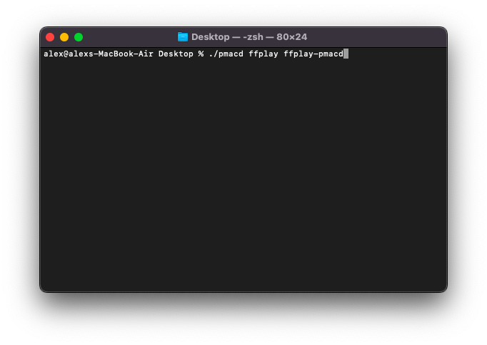
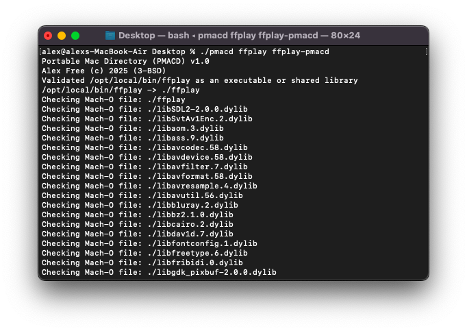
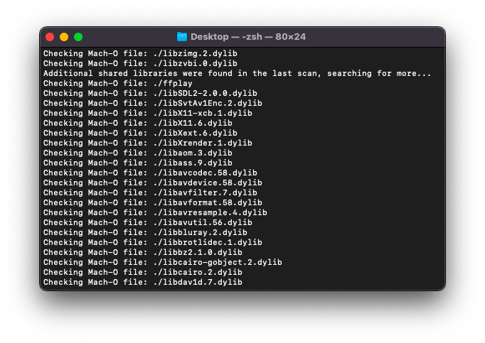
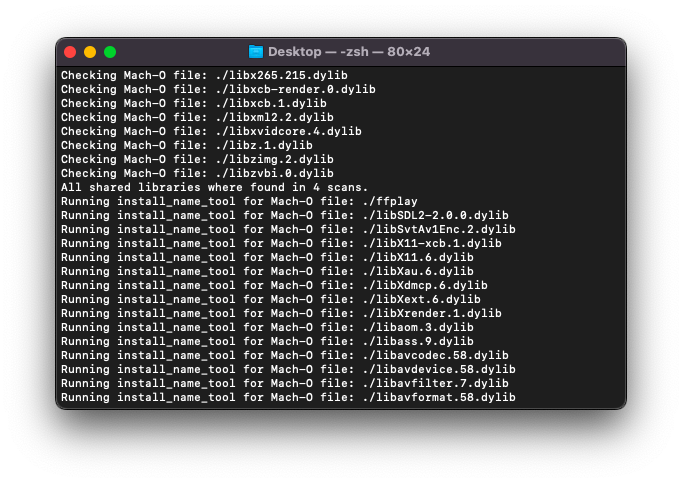
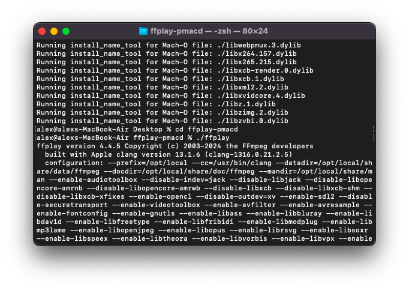
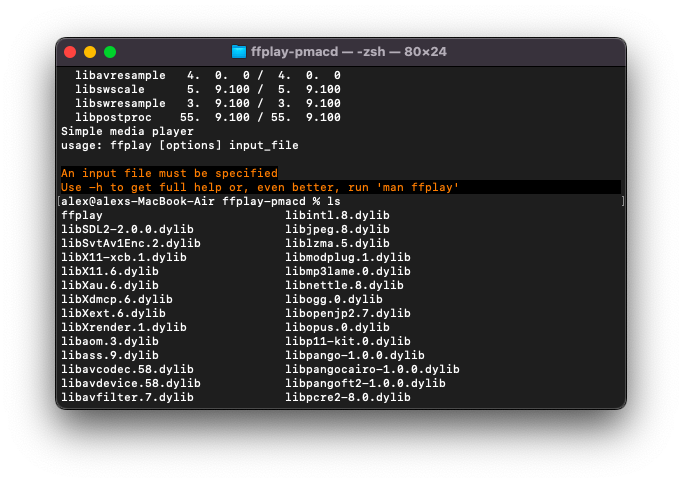
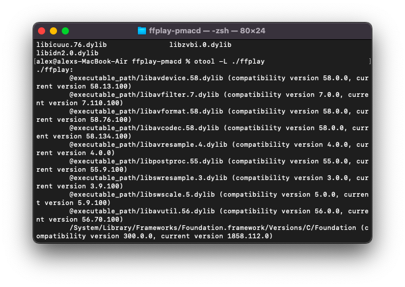

# Portable Mac Directory (PMacD)

_By Alex Free_

Makes Mac OS executables portable. Release dynamically linked Mac OS executables with ‘Windows-like software portability’. On Windows it is common for software to be distributed as an executable in it’s own folder, which also contains any dynamically linked libraries. This ensures it can ‘run anywhere`. You can do this on Windows because the library linker searches the directory that the executable file is in for the dynamic libraries it needs to run (which Linux does not do). This behavior is very desirable an OS such as Mac OS. Packaging software for Mac OS can become a nightmare quickly when dynamic libraries are involved. This is common when you have [Homebrew](https://brew.sh/) or [MacPorts](https://www.macports.org/) to install dependencies you need to build and run your executable.

Portable Mac Directory is designed to make releasing Mac OS software easy and accessible by bringing the same Windows behavior and ideas to Mac OS. The Portable Mac Directory version of a Mac OS executable will run on any Mac with the same Mac OS version, and newer versions should also work fine. This is because the portable mac directory version is a directory containing all dynamically linked shared libraries and the executable points to them.

This is basically the same thing as my [Portable Linux Executable Directory](https://github.com/alex-free/pled) tool but for all Mac OS X/Mac OS versions since 10.4! I have been wanting to write this tool for Mac OS for literal years and I finally got around to it.

| [Homepage](https://alex-free.github.io/portable-mac-directory) | [Github](https://github.com/alex-free/portable-mac-directory) |

## Table Of Contents

* [Downloads](#downloads)
* [Requirements](#requirements)
* [Usage](#usage)
* [Requirements For Portability](#requirements-for-portability)
* [Further Notes](#further-notes)
* [Real World Examples](#real-world-examples)
* [Building](build.md)
* [License](license.md)

## Downloads

### Version 1.0 (2/4/2025)

* [portable-mac-directory-v1.0.zip](https://github.com/alex-free/portable-mac-directory/releases/download/v1.0/portable-mac-directory-v1.0.zip) _For Mac OS X 10.4 and newer_

## Requirements

* Xcode installed. On newer Mac OS versions you need Xcode Command line tools, specifically. You can find a list of direct apple links of Xcode downloads at [xcodereleases.com](https://xcodereleases.com/).

* Mac OS X 10.4 you need MacPorts as well because you need to install `cctools` from MacPorts to get the `otool` and `install_name_tool` programs. You can do this by executing `sudo port install cctools`. These programs are included in all Xcode versions supporting Mac OS X 10.5 and above though.

## Usage

Portable Mac Directory expects 2 arguments. The first is the full executable file (or shared library) path or the name of a command in your `$PATH` (the one that you want to make portable). The second is the full path to the output `pmacd` (the directory which will contain the portable version of the executable file referenced in the first argument). For example either of these commands below may be used to achieve the exact same end result, which is  a `ffplay-pmacd` directory which contains a portable `ffplay` executable.

`./pmacd ffplay ffplay-pmacd`

`./pmacd /opt/local/bin/ffplay`

Here is how I make the `ffplay` from Macports (previously I did `sudo port install ffmpeg`) portable on Mac OS 12:

## Requirements For Portability

### Real Dynamically Linked Executable File

Portable Mac Directory **requires an actual executable file as the first argument and NOT a shell-script wrapper**. Some software installed by Homebrew or MacPorts may actually be a shell script wrapper, but be presented as the executable. Portable Mac Directory will refuse to function on such a shell script wrapper, as it verifies if the first argument is an actual executable file. If Portable Mac Directory finds this not to be the case, it will helpfully offer to display the shell script wrapper's contents to help you figure out where the real executable is. This is a good start, but typically it may be easier to just recompile the target software entirely yourself, figure out the configuration and any required external files, and then go from there. 

### External Resource Files

Many executables may expect explicit file paths to things like config files, databases, etc. Portable Mac Directory has no way of knowing about any such files that the executable may need to run correctly and as intended. When making a program portable with Portable Mac Directory, it is important to figure out how to set the program to use portable, self-contained resource files such as these. Compiling a program from scratch is sometimes the easiest way to accomplish this.

## Further Notes

Modern Mac OS (at least Mac OS 12) has executables link to system libraries and frameworks which are not actually present as files on your system partition. For example, `/usr/lib/libSystem.B.dylib` is not an actual file. Portable Mac Directory does check for this and still works if this is the case.

As of right now, Portable Mac Directory copies every dynamically linked library. That includes all system frameworks and system libraries (if they are actual files on disk as discussed above in newer Mac OS versions this is not the case). There may be an option or change in the future where system frameworks and libraries can be ignored, but all other dynamically linked libraries are still copied (since this may be overkill for some uses).

## Real World Examples

I've used Portable Mac Directory for my [Source Engine Mac App](https://github.com/alex-free/source-engine-mac-app). Many more to come!